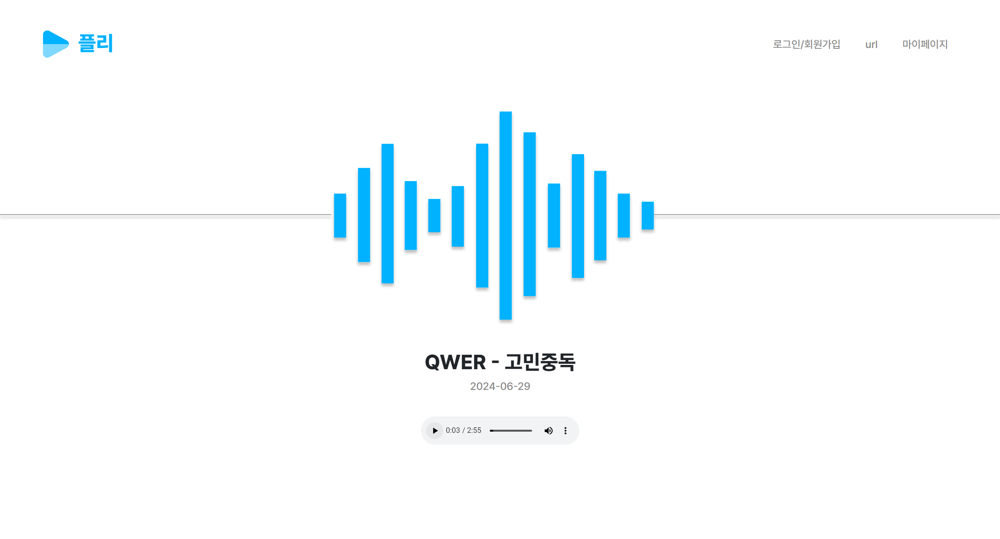

# 플리

> 라이브뮤직반 당시 youtube로 노래방을 틀고자 했을 때 사용자가 직접 키를 조절한다던가 동영상의 빠르기 등을 손쉽게 변경할 수 없어 불편했던 상황이 있었습니다. 이를 해결하고자 사용자가 직접 맞춤형으로 조절할 수 있고 url로 플레이리스트를 만들어 음악 스트리밍을 관리하는 웹서비스를 만들고자 합니다.

## 프로젝트 기간

- 2024-05-18 ~ 2024-06-29

## 주요 기능

- 첫 메인화면으로 본인이 최근에 들은 곡이 나와 있으며 재생할 수 있습니다.
- 동영상 url 추가 화면으로 url 작성만 하면 해당 동영상이 나오며 아래에 부가 기능으로 동영상을 커스텀 마이징할 수 있는 옵션들이 주어집니다. (ex. 키 조절, 동영상 빠르기)
- 동영상을 플레이리스트에 저장하여 보관할 수 있습니다. 이 때 플레이리스트는 폴더와 동일한 방식으로 여러개 저장하여 보관할 수 있습니다.

## 서비스 분석

- 최근 사람들의 Youtube 수요가 많다는 점과 키 조절하는 플랫폼이 흔하지 않다는 점으로 사람들의 수요가 많을 것으로 예상되고, 특히 커버곡과 같은 Youtube에만 있는 동영상들을 url로 빠르게 재생할 수 있어 서비스에 장점을 부각시켜줄 것 같습니다.

## 유사 서비스

- 멜론 : 플레이리스트
  - 플레이리스트에 본인 음악을 저장하고 반복 재생 및 한 곡만 연속 듣기 기능 지원.
  - 차별점 : 음원과 mp3를 지원하지만 youtube의 커버송처럼 다양한 목적의 음악은 지원하지 않아 이를 서비스에서 해결합니다.

---

## 프로젝트 설명

1. startproject playList
   1. python -m pip install django~=4.2
   2. django-admin startproject playList
   3. File > Settings... > Language & Framework > Django > [v] Enable Django Support
   4. Run > Edit Configurations... > + Django Server > Name: runserver
   5. VCS > Enable Version Control Integration... > git > ok
2. startapp 플리
   1. python manage.py startapp 플리
   2. '플리', in INSTALLED_APPS in settings.py
3. 플리/
   1. models
      1. User
         1. id, pw, created_at, updated_at
      2. PlayList
         1. id, title, image, created_at, updated_at, author
      3. python manage.py makemigrations 플리
      4. python manage.py migrate
   2. views
      1. show_index
      2. show_login
      3. show_signup
      4. show_mypage
      5. show_create
      6. show_delete
      7. show_update
      8. show_detail
      9. show_video_create
      10. show_video_delete
      11. show_url
   3. templates/플리/
      1. index.html
      2. login.html
      3. signup.html
      4. playlist_list.html
      5. playlist_create.html
      6. playlist_confirm_delete.html
      7. playlist_update.html
      8. playlist_detail.html
      9. video_create.html
      10. video_confirm_delete.html
      11. url.html
   4. urls
      1. 플리:show_index
      2. 플리:EmailLoginView.as_view()
      3. 플리:SingUpView.as_view()
      4. 플리:PlayListView.as_view()
      5. 플리:PlayListCreateView.as_view()
      6. 플리:PlayListDeleteView.as_view()
      7. 플리:PlayListUpdateView.as_view()
      8. 플리:PlayListDetailView.as_view()
      9. 플리:VideoCreateView.as_view()
      10. 플리:VideoDeleteView.as_view()
      11. 플리:show_url
   5. static/
      1. css/
         1. style.css > 전역 스타일 시트
         2. index.css > index html 스타일 시트
         3. login.css > login, signup html 스타일 시트 
         4. create.css > playList create html 스타일 시트
         5. delete.css > playList delete html 스타일 시트
         6. mypage.css > playList list view html 스타일 시트
         7. detail.css > playlist detail html 스타일 시트
         8. video-create.css > video create html 스타일 시트
         9. url.css > url html 스타일 시트
      2. img/
         1. solar_play-bold-duotone.svg > 로고 이미지
         2. sound-bar.svg > 사운드바 이미지
         3. delete.svg > playList 삭제 이미지
         4. edit.svg > playList 수정 이미지
      3. audio
         1. 고민중독.mp3 > index 메인 오디오
4. templates/
   1. base.html
      1. settings.py > TEMPLATES
         1. 'DIRS': [BASE_DIR / 'templates']
